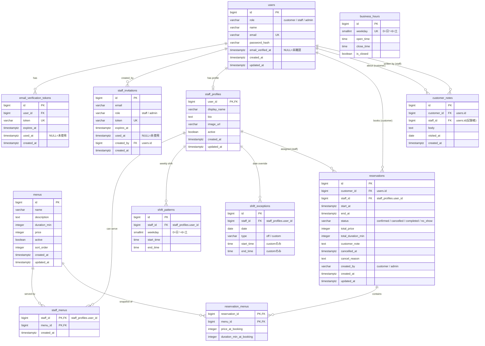
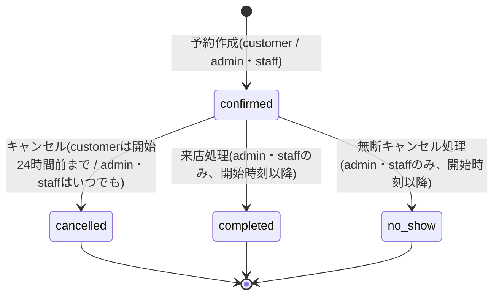

# DB設計書 — Lumina Reserve

PostgreSQLを前提としたデータベース設計書です。型はPostgreSQLの表記で書いていますが、使用するORM(Prisma / JPA / SQLAlchemy / Eloquent / GORM / Active Record)のマイグレーション機能で同等の定義を作成してください。

- 主キーはすべて `BIGSERIAL`(自動採番)です。ただし `staff_profiles` はusersと1対1のため `user_id` を主キーに、中間テーブル(`staff_menus`、`reservation_menus`)は複合主キーにします。
- 日時は `TIMESTAMPTZ`(UTC保存)、営業時間・シフトの時刻は `TIME`(JSTの壁時計時刻)、日付は `DATE` を使います。
- 文字列ステータス(`role`、`status`、`type` など)はCHECK制約付きの `VARCHAR` とします(ネイティブENUMでも構いませんが、値は本書と完全一致させること)。

## ER図



## テーブル定義

### users

全ロール共通のユーザーテーブルです。

| カラム | 型 | NULL | デフォルト | 説明 |
|---|---|---|---|---|
| id | BIGSERIAL | NO | 自動採番 | 主キー |
| role | VARCHAR(20) | NO | `'customer'` | `customer` / `staff` / `admin`(CHECK制約) |
| name | VARCHAR(100) | NO | — | 氏名 |
| email | VARCHAR(255) | NO | — | メールアドレス。UNIQUE |
| password_hash | VARCHAR(255) | NO | — | bcrypt等のハッシュ。平文禁止 |
| email_verified_at | TIMESTAMPTZ | YES | NULL | メール確認完了日時。NULLは未確認(ログイン不可)。招待経由の登録では登録時刻を入れる |
| created_at | TIMESTAMPTZ | NO | `now()` | 作成日時 |
| updated_at | TIMESTAMPTZ | NO | `now()` | 更新日時 |

### email_verification_tokens

customerサインアップ時のメール確認トークンです。

| カラム | 型 | NULL | デフォルト | 説明 |
|---|---|---|---|---|
| id | BIGSERIAL | NO | 自動採番 | 主キー |
| user_id | BIGINT | NO | — | FK → users.id(ON DELETE CASCADE) |
| token | VARCHAR(64) | NO | — | ランダムトークン。UNIQUE。URLに載せるためURL-safeな文字のみ |
| expires_at | TIMESTAMPTZ | NO | — | 有効期限(発行から24時間) |
| used_at | TIMESTAMPTZ | YES | NULL | 使用日時。NULLは未使用。使用済みトークンは再利用不可 |
| created_at | TIMESTAMPTZ | NO | `now()` | 作成日時 |

### staff_invitations

adminが発行するstaff・admin登録用の招待です。

| カラム | 型 | NULL | デフォルト | 説明 |
|---|---|---|---|---|
| id | BIGSERIAL | NO | 自動採番 | 主キー |
| email | VARCHAR(255) | NO | — | 招待先メールアドレス |
| role | VARCHAR(20) | NO | — | 登録されるロール。`staff` / `admin`(CHECK制約) |
| token | VARCHAR(64) | NO | — | 招待トークン。UNIQUE |
| expires_at | TIMESTAMPTZ | NO | — | 有効期限(発行から72時間) |
| used_at | TIMESTAMPTZ | YES | NULL | 使用日時。NULLは未使用 |
| created_by | BIGINT | NO | — | FK → users.id。発行したadmin |
| created_at | TIMESTAMPTZ | NO | `now()` | 作成日時 |

### staff_profiles

スタッフの公開プロフィールです。usersと1対1で、`role` が `staff`(施術を担当する場合は `admin` も可)のユーザーに作成します。指名一覧・空き枠検索の対象は「このテーブルに行があり `active = true`」のスタッフです。

| カラム | 型 | NULL | デフォルト | 説明 |
|---|---|---|---|---|
| user_id | BIGINT | NO | — | 主キー。FK → users.id |
| display_name | VARCHAR(100) | NO | — | 顧客向け表示名(例: `AOI`) |
| bio | TEXT | NO | `''` | 自己紹介 |
| image_url | VARCHAR(500) | YES | NULL | プロフィール画像URL(アップロード機能は作らず、URL文字列のみ) |
| active | BOOLEAN | NO | `false` | 有効フラグ。falseは指名・空き枠検索の対象外 |
| created_at | TIMESTAMPTZ | NO | `now()` | 作成日時 |
| updated_at | TIMESTAMPTZ | NO | `now()` | 更新日時 |

### menus

施術メニューです。

| カラム | 型 | NULL | デフォルト | 説明 |
|---|---|---|---|---|
| id | BIGSERIAL | NO | 自動採番 | 主キー |
| name | VARCHAR(100) | NO | — | メニュー名(例: カット) |
| description | TEXT | NO | `''` | 説明文 |
| duration_min | INTEGER | NO | — | 所要時間(分)。CHECK `duration_min > 0`。30分単位を推奨 |
| price | INTEGER | NO | — | 税込価格(円)。CHECK `price >= 0` |
| active | BOOLEAN | NO | `true` | 有効フラグ。falseは顧客向け一覧・空き枠検索の対象外 |
| sort_order | INTEGER | NO | `0` | 表示順(昇順) |
| created_at | TIMESTAMPTZ | NO | `now()` | 作成日時 |
| updated_at | TIMESTAMPTZ | NO | `now()` | 更新日時 |

### staff_menus

スタッフが対応可能なメニューの紐付け(多対多の中間テーブル)です。

| カラム | 型 | NULL | デフォルト | 説明 |
|---|---|---|---|---|
| staff_id | BIGINT | NO | — | FK → staff_profiles.user_id。複合主キーの一部 |
| menu_id | BIGINT | NO | — | FK → menus.id。複合主キーの一部 |
| created_at | TIMESTAMPTZ | NO | `now()` | 作成日時 |

主キー: `(staff_id, menu_id)`

### business_hours

店舗の営業時間です。7曜日分(0〜6)の行をシードで作成し、以後は更新のみ行います。

| カラム | 型 | NULL | デフォルト | 説明 |
|---|---|---|---|---|
| id | BIGSERIAL | NO | 自動採番 | 主キー |
| weekday | SMALLINT | NO | — | 曜日。0=日〜6=土。UNIQUE、CHECK `0 <= weekday AND weekday <= 6` |
| open_time | TIME | YES | NULL | 開店時刻(JST)。`is_closed = true` のときのみNULL可 |
| close_time | TIME | YES | NULL | 閉店時刻(JST)。同上。CHECK `open_time < close_time` |
| is_closed | BOOLEAN | NO | `false` | 定休日フラグ |

CHECK制約: `is_closed OR (open_time IS NOT NULL AND close_time IS NOT NULL)`

### shift_patterns

スタッフの週次シフトパターンです。行がない曜日は勤務なしです。

| カラム | 型 | NULL | デフォルト | 説明 |
|---|---|---|---|---|
| id | BIGSERIAL | NO | 自動採番 | 主キー |
| staff_id | BIGINT | NO | — | FK → staff_profiles.user_id(ON DELETE CASCADE) |
| weekday | SMALLINT | NO | — | 曜日。0=日〜6=土。CHECK `0 <= weekday AND weekday <= 6` |
| start_time | TIME | NO | — | 勤務開始(JST) |
| end_time | TIME | NO | — | 勤務終了(JST)。CHECK `start_time < end_time` |

一意制約: `UNIQUE(staff_id, weekday)`

### shift_exceptions

特定日のシフト上書きです。パターンより優先されます。

| カラム | 型 | NULL | デフォルト | 説明 |
|---|---|---|---|---|
| id | BIGSERIAL | NO | 自動採番 | 主キー |
| staff_id | BIGINT | NO | — | FK → staff_profiles.user_id(ON DELETE CASCADE) |
| date | DATE | NO | — | 対象日 |
| type | VARCHAR(10) | NO | — | `off`(終日休み) / `custom`(勤務時間の上書き)。CHECK制約 |
| start_time | TIME | YES | NULL | `custom` のときの勤務開始。`off` ではNULL |
| end_time | TIME | YES | NULL | `custom` のときの勤務終了。CHECK `start_time < end_time` |

一意制約: `UNIQUE(staff_id, date)`
CHECK制約: `type = 'off' OR (start_time IS NOT NULL AND end_time IS NOT NULL)`

### reservations

予約本体です。本システムの中心テーブルです。

| カラム | 型 | NULL | デフォルト | 説明 |
|---|---|---|---|---|
| id | BIGSERIAL | NO | 自動採番 | 主キー |
| customer_id | BIGINT | NO | — | FK → users.id。予約した顧客 |
| staff_id | BIGINT | NO | — | FK → staff_profiles.user_id。担当スタッフ |
| start_at | TIMESTAMPTZ | NO | — | 施術開始日時 |
| end_at | TIMESTAMPTZ | NO | — | 施術終了日時 = `start_at` + `total_duration_min` 分。CHECK `start_at < end_at` |
| status | VARCHAR(20) | NO | `'confirmed'` | `confirmed` / `cancelled` / `completed` / `no_show`(CHECK制約) |
| total_price | INTEGER | NO | — | 合計金額(円)。予約時点のメニュー価格合計のスナップショット |
| total_duration_min | INTEGER | NO | — | 合計所要時間(分)。予約時点のスナップショット |
| customer_note | TEXT | YES | NULL | 顧客からの要望メモ |
| cancelled_at | TIMESTAMPTZ | YES | NULL | キャンセル日時。`status = 'cancelled'` のとき必須 |
| cancel_reason | TEXT | YES | NULL | キャンセル理由(任意) |
| created_by | VARCHAR(20) | NO | `'customer'` | `customer`(顧客自身) / `admin`(店舗側の手動登録。staffの操作も `admin` と記録する)。CHECK制約 |
| created_at | TIMESTAMPTZ | NO | `now()` | 作成日時 |
| updated_at | TIMESTAMPTZ | NO | `now()` | 更新日時 |

### reservation_menus

予約に含まれるメニューのスナップショットです。

| カラム | 型 | NULL | デフォルト | 説明 |
|---|---|---|---|---|
| reservation_id | BIGINT | NO | — | FK → reservations.id(ON DELETE CASCADE)。複合主キーの一部 |
| menu_id | BIGINT | NO | — | FK → menus.id。複合主キーの一部 |
| price_at_booking | INTEGER | NO | — | 予約時点の価格(円) |
| duration_min_at_booking | INTEGER | NO | — | 予約時点の所要時間(分) |

主キー: `(reservation_id, menu_id)`(同一予約に同じメニューは1つまで)

### customer_notes

顧客ごとの施術メモ(カルテ)です。顧客本人には公開しません。

| カラム | 型 | NULL | デフォルト | 説明 |
|---|---|---|---|---|
| id | BIGSERIAL | NO | 自動採番 | 主キー |
| customer_id | BIGINT | NO | — | FK → users.id。対象の顧客 |
| staff_id | BIGINT | NO | — | FK → users.id。記録したstaff・admin |
| body | TEXT | NO | — | メモ本文(施術内容、薬剤、会話メモなど) |
| visited_at | DATE | NO | — | 施術日 |
| created_at | TIMESTAMPTZ | NO | `now()` | 作成日時 |

## インデックスと一意制約の方針

UNIQUE制約(上記の各表に記載)に加えて、次のインデックスを作成します。

| テーブル | インデックス | 目的 |
|---|---|---|
| reservations | `INDEX (staff_id, start_at)` | 空き枠計算・予約ボードでの「スタッフ×日付」検索。最重要 |
| reservations | `INDEX (customer_id, start_at)` | マイページの予約一覧 |
| email_verification_tokens | `UNIQUE (token)` | トークン照合 |
| staff_invitations | `UNIQUE (token)` | トークン照合 |
| users | `UNIQUE (email)` | ログイン・重複登録防止 |
| shift_exceptions | `UNIQUE (staff_id, date)` | 1日1件の例外 |
| shift_patterns | `UNIQUE (staff_id, weekday)` | 1曜日1行のパターン |
| business_hours | `UNIQUE (weekday)` | 1曜日1行 |
| customer_notes | `INDEX (customer_id, visited_at)` | カルテの時系列表示 |

### 二重予約の防止

「同一スタッフの `confirmed` 予約の時間帯が重ならない」というルールは、UNIQUE制約では表現できません(時間帯は範囲の重なりであり、値の一致ではないため)。本プロジェクトでは**アプリケーション側のトランザクション+行ロックを基本方針**とします。

1. トランザクションを開始する。
2. `SELECT ... FOR UPDATE` で対象スタッフの `staff_profiles` の行をロックする(そのスタッフへの予約作成を直列化するためのロック)。
3. ロック取得後に、重複する `confirmed` 予約が存在しないかを検索する(`staff_id = ? AND status = 'confirmed' AND start_at < :end_at AND end_at > :start_at`)。
4. 存在しなければINSERTしてコミット。存在すれば `409 RESERVATION_CONFLICT` でロールバックする。

「先に重複予約の行を `FOR UPDATE` で検索する」だけでは不十分な点に注意してください。重複行が0件のとき、ロックする行がなく2つのトランザクションが同時にINSERTまで到達できます(ファントム)。そのため、必ず存在が保証されている親行(`staff_profiles`)をロックして直列化します。具体的な実装手順と競合テストの書き方は [reservation-domainスキル](../.claude/skills/reservation-domain/SKILL.md) にまとめています。

**発展: PostgreSQLのEXCLUDE制約**

PostgreSQLには、範囲の重なりをDB制約として禁止できる `EXCLUDE` 制約があります(btree_gist拡張が必要)。

```sql
CREATE EXTENSION IF NOT EXISTS btree_gist;

ALTER TABLE reservations
  ADD CONSTRAINT no_double_booking
  EXCLUDE USING gist (
    staff_id WITH =,
    tstzrange(start_at, end_at) WITH &&
  )
  WHERE (status = 'confirmed');
```

これを張るとアプリのバグでも二重予約がDBレベルで拒否されます(多層防御)。ただしORMからの扱いが特殊で、違反時のエラーハンドリングも必要になるため、本プロジェクトでは**任意の発展課題**とします。基本方針のロック実装と競合テストは、EXCLUDE制約を張る場合でも必須です。

## reservationsのステータス遷移

`status` は `confirmed` を起点とする一方向の遷移のみを許可します。`cancelled` / `completed` / `no_show` は終端で、以後の変更はできません。



| 遷移 | 実行できるロール | 条件 |
|---|---|---|
| (新規) → confirmed | customer / staff / admin | 空き枠ルールと二重予約防止を満たすこと |
| confirmed → cancelled | customer(本人) | 現在時刻 ≤ 開始時刻の24時間前 |
| confirmed → cancelled | staff / admin | 制限なし(電話キャンセル・店舗都合) |
| confirmed → completed | staff / admin | 現在時刻 ≥ 開始時刻 |
| confirmed → no_show | staff / admin | 現在時刻 ≥ 開始時刻 |
| 上記以外 | — | すべて `422 INVALID_STATUS_TRANSITION` で拒否 |

## シードデータ

M1-02(スキーマ初期化)で、最低限次のシードを投入してください。

- 初期adminユーザー1名(例: `admin@lumina.example`)。招待発行の起点になるため必須です。パスワードは環境変数またはシードスクリプト内の固定値とし、READMEに記載します。
- business_hoursの7行(火〜金 10:00〜19:00、土日 09:00〜18:00、月曜 `is_closed = true`)。
- 動作確認用のメニュー5件(カット60分4,950円、カラー90分8,800円、パーマ120分11,000円、トリートメント30分3,300円、ヘッドスパ30分3,850円)を推奨します。
