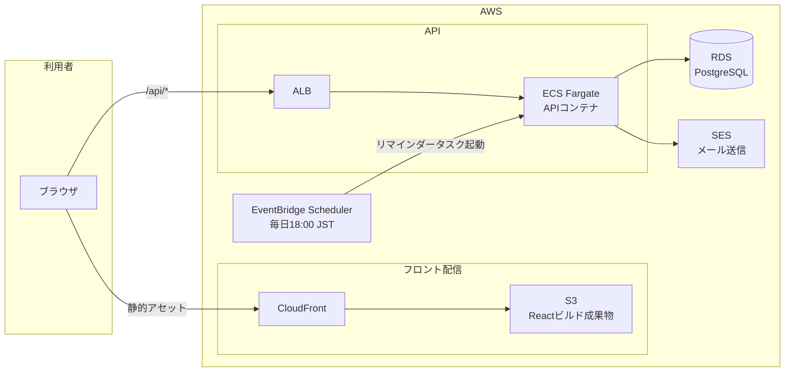

# インフラ設計書 — Lumina Reserve

ローカル開発環境の構成と、本番を想定したAWS構成の設計書です。**AWSへのデプロイは任意課題**です。issueの必須範囲はローカルで完結します(CI(M4-04)はGitHub Actions上で動かします)。

## ローカル開発構成

ミドルウェア(PostgreSQL、メールキャッチャー)はdocker composeで起動し、APIとフロントはホストマシンで直接実行する構成を推奨します(ホットリロードが素直に効くため)。APIやフロントもコンテナ化して構いません。

### ディレクトリ構成の例

APIとフロントはリポジトリルート直下の `api/` と `web/` に置き、`docker-compose.yml` はルートに置く構成を推奨します(以後のドキュメント・issueはこの配置を前提に書きます)。

```text
<リポジトリルート>
├── docker-compose.yml
├── .env                # compose用(POSTGRES_PORT など)
├── api/                # バックエンド(選択したスタック)
│   └── .env
├── web/                # フロントエンド(React + Vite + TypeScript)
│   └── .env
└── docs/               # 仕様書(テンプレート由来。そのまま残す)
```

```yaml
# docker-compose.yml の例
services:
  db:
    image: postgres:16
    environment:
      POSTGRES_USER: lumina
      POSTGRES_PASSWORD: lumina
      POSTGRES_DB: lumina_reserve
    ports:
      - "${POSTGRES_PORT:-5432}:5432"
    volumes:
      - db_data:/var/lib/postgresql/data
  mailhog:
    image: mailhog/mailhog:v1.0.1
    platform: linux/amd64   # Apple Silicon(arm64)ではこの指定が必要(arm64イメージが無いため)。代替としてMailpit(axllent/mailpit)も可
    ports:
      - "1025:1025"   # SMTP(アプリからの送信先)
      - "8025:8025"   # Web UI(受信メールの確認)
volumes:
  db_data:
```

| コンポーネント | 実行場所 | ポート例 | 説明 |
|---|---|---|---|
| PostgreSQL 16 | docker compose | 5432 | アプリDB。テスト用DBは別スキーマまたは別DB名で用意する |
| MailHog | docker compose | 1025 / 8025 | 開発用メールキャッチャー。確認メール・招待メール・リマインダーを `http://localhost:8025` で目視確認する |
| API | ホスト(コンテナも可) | 3000など | 選択したスタックの開発サーバー |
| フロント(React + Vite) | ホスト | 5173 | `VITE_API_URL` でAPIのURLを指定し、CORS + Cookieで接続 |

- 上表の「ポート例」はコンテナ側・既定値を規範とします。ホスト側のポートが既に使われている場合は、環境変数(`POSTGRES_PORT` など)でホスト側だけ変更して構いません(その場合は接続文字列も合わせます)。
- アプリからのメール送信はSMTP(`localhost:1025`)に向けます。本番だけSESに切り替えられるよう、メール送信は1モジュールに集約してください。
- 環境変数は `.env.example` をリポジトリに置き、`.env` はgitignoreします。

### 環境変数の正準一覧

環境変数の置き場所と名前は次に統一します(issue・docsはこの名前を前提とします)。

| ファイル | 変数 | 用途 |
|---|---|---|
| ルート `.env` | `POSTGRES_PORT` | composeがホスト側に公開するPostgreSQLポート(既定 5432) |
| `api/.env` | `DATABASE_URL` | PostgreSQL接続文字列 |
| `api/.env` | `JWT_SECRET` | JWT署名シークレット |
| `api/.env` | `SMTP_HOST` / `SMTP_PORT` | メール送信先(開発では `localhost` / `1025`) |
| `api/.env` | `FRONTEND_ORIGIN` | CORSで許可するフロントのorigin(例: `http://localhost:5173`) |
| `api/.env` | `PORT` | APIのリッスンポート(例: 3000) |
| `api/.env` | `SEED_ADMIN_PASSWORD` | シードの初期adminパスワード([DB設計書 - シードデータ](./database.md#シードデータ)) |
| `web/.env` | `VITE_API_URL` | APIのベースURL(例: `http://localhost:3000`) |

## 本番想定のAWS構成

カリキュラムの /aws/ セクションで学んだ構成(CloudFront + S3、ALB + ECS Fargate、RDS)をそのまま適用できます。CDKで書いた構成の流用を推奨します。Route 53(独自ドメイン)は省略し、CloudFrontとALBのデフォルトドメインで確認する想定です。



### 各サービスの役割

| サービス | 役割 | 補足 |
|---|---|---|
| CloudFront + S3 | Reactのビルド成果物を配信 | S3は非公開バケット+OAC。SPAのため404を `index.html` にフォールバック |
| ALB | APIへのHTTPS終端とルーティング | ヘルスチェックパス(例: `GET /api/health`)を用意する |
| ECS Fargate | APIコンテナの実行 | 学習用途はタスク1個で十分。DBマイグレーションの実行方法(タスク起動時 or 手動タスク)を決めておく |
| RDS(PostgreSQL) | アプリDB | 学習用途は `db.t4g.micro`・シングルAZで十分 |
| SES | 確認・招待・リマインダーメールの送信 | サンドボックス解除前は検証済みアドレスにしか送れない。学習では検証済みの自分のアドレス宛で確認すれば十分 |
| EventBridge Scheduler | リマインダーの定時起動 | cron式 `cron(0 18 * * ? *)`(Asia/Tokyo指定)でECSの一回性タスク(またはLambda)を起動し、翌日分の `confirmed` 予約にメールを送る |

- リマインダー(S-1)のローカル実装は、アプリ内スケジューラ(node-cron、Spring @Scheduled、Celery beat、Laravel scheduler、goroutine + ticker、whenever等)または「手動実行できるCLIコマンド」で構いません。本番では上図のようにスケジューラを外出しする、という対応関係を理解しておいてください。
- JWTシークレットやDBパスワードは、本番ではSecrets Manager(またはSSM Parameter Store)に置き、タスク定義から注入します。

## コストの注意(必読)

このAWS構成には**無料枠を超えやすいサービスが含まれます**。デプロイは任意課題であり、面接前のデモ等で必要な期間だけ立てて、終わったら必ず削除してください。

| サービス | コスト目安 | 注意 |
|---|---|---|
| ALB | 約$16〜/月 | 起動しているだけで課金。無料枠なし(12ヶ月無料枠対象外のリージョン・条件に注意) |
| ECS Fargate | 約$10〜/月(0.25vCPU/0.5GB常時) | タスクを0にすればほぼ無料 |
| RDS | 無料枠(12ヶ月)対象だが超過しやすい | 停止しても7日で自動再起動する。不要になったら削除+スナップショット削除 |
| CloudFront / S3 / SES / EventBridge | ほぼ無料枠内 | 学習用途の量なら問題なし |

**学習後の削除手順**: CDKで構築した場合は `cdk destroy` で一括削除できます(これがCDKを推奨する理由の1つです)。手動構築の場合は、ECSサービス → ALB → RDS(スナップショット含む) → S3バケット(空にしてから) → CloudFront → EventBridge Schedulerの順に削除し、最後に請求ダッシュボードで課金が止まったことを翌日確認してください。

## CI(GitHub Actions)

M4-04で構築します。デプロイとは独立して必須です。

- pushとPRで起動し、テストとビルド(フロント・API両方)を実行する
- PostgreSQLはGitHub Actionsのserviceコンテナで起動する
- mainブランチへのマージ条件を「CIグリーン」にする(ブランチ保護は任意)
