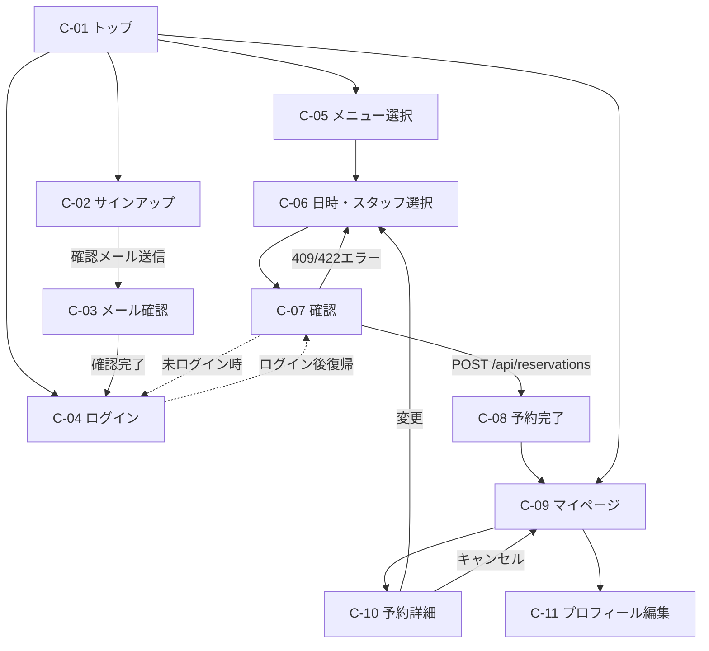
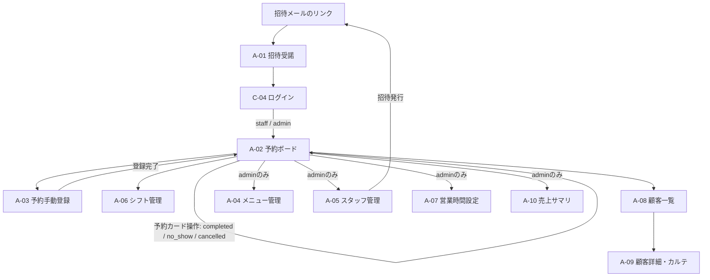

# 画面定義書 — Lumina Reserve

フロントエンドの画面定義です。React + Vite + TypeScript(SNSカリキュラムと同じ構成)を推奨しますが、フレームワークは自由です。デザイン(配色・レイアウトの細部)は自由で、ここでは**画面の構成要素と遷移**だけを固定します。

- 画面IDは customer向けを `C-xx`、staff・admin向けを `A-xx` とします。issueやPRでは画面IDで参照してください。
- customer向けとstaff・admin向けは同一SPA内のルート分けでも、別アプリでも構いません(ルート分けを推奨)。

## 画面一覧

### customer向け

| ID | 画面名 | パス例 | ロール | 概要 |
|---|---|---|---|---|
| C-01 | トップ | `/` | 全員(未ログイン可) | 店舗紹介、メニュー一覧、スタッフ紹介、予約開始ボタン |
| C-02 | サインアップ | `/signup` | 未ログイン | メールアドレス・名前・パスワードで登録。送信後「確認メールを送りました」表示 |
| C-03 | メール確認 | `/verify-email?token=...` | 未ログイン | 確認メールのリンク先。トークンを検証し結果を表示 |
| C-04 | ログイン | `/login` | 未ログイン | メールアドレス+パスワード。customer・staff・admin共通 |
| C-05 | 予約ステップ1: メニュー選択 | `/reserve/menus` | 全員(未ログイン可) | メニューを複数選択。合計所要時間・合計金額を表示 |
| C-06 | 予約ステップ2: 日時・スタッフ選択 | `/reserve/slots` | 全員(未ログイン可) | 日付選択、指名(任意)、空き枠一覧の表示・選択 |
| C-07 | 予約ステップ3: 確認 | `/reserve/confirm` | customer | 内容確認、要望メモ入力、確定ボタン。未ログインならC-04を経由 |
| C-08 | 予約完了 | `/reserve/done` | customer | 予約番号と内容の表示、マイページへの導線 |
| C-09 | マイページ | `/mypage` | customer | 今後の予約 / 過去の予約のタブ表示 |
| C-10 | 予約詳細 | `/mypage/reservations/:id` | customer | メニュー内訳・金額の確認、変更・キャンセル操作 |
| C-11 | プロフィール編集 | `/mypage/profile` | customer | 名前・パスワードの変更 |

### staff・admin向け

| ID | 画面名 | パス例 | ロール | 概要 |
|---|---|---|---|---|
| A-01 | 招待受諾 | `/invitations/accept?token=...` | 未ログイン | 招待メールのリンク先。名前・パスワードを入力して登録完了 |
| A-02 | 予約ボード | `/admin/board` | staff / admin | 日別タイムライン(縦=時刻、横=スタッフ)。ステータス操作の起点 |
| A-03 | 予約手動登録 | `/admin/board/new` | staff / admin | 電話予約の登録フォーム(モーダルでも可) |
| A-04 | メニュー管理 | `/admin/menus` | admin | メニューの一覧・作成・編集・無効化・並び順変更 |
| A-05 | スタッフ管理 | `/admin/staff` | admin | スタッフ一覧、プロフィール編集、対応メニュー設定、招待発行 |
| A-06 | シフト管理 | `/admin/shifts` | staff / admin | 週次パターン編集とシフト例外の登録(staffは自分の分のみ) |
| A-07 | 営業時間設定 | `/admin/business-hours` | admin | 曜日ごとの開店・閉店・定休日の設定 |
| A-08 | 顧客一覧 | `/admin/customers` | staff / admin | 検索ボックス+顧客一覧 |
| A-09 | 顧客詳細・カルテ | `/admin/customers/:id` | staff / admin | 予約履歴とカルテの時系列表示、カルテ追加 |
| A-10 | 売上サマリ | `/admin/summary` | admin | 月選択、月合計・日別売上の表示 |

- ログイン画面はC-04を全ロールで共用します。ログイン後、customerはC-01へ、staff・adminはA-02へ遷移します。
- staffがadmin専用画面(A-04、A-05、A-07、A-10)のパスを開いた場合は「権限がありません」を表示します(API側も403を返します)。

## 主要画面の構成要素

### C-05 → C-06 → C-07: 予約フロー(3ステップ)

予約フローは画面上部にステップインジケーター(1 メニュー → 2 日時 → 3 確認)を常時表示し、前のステップへ戻れるようにします。選択状態はフロント側で保持します(URLクエリまたはストア。リロードで消えても構いません)。

**C-05 予約ステップ1: メニュー選択**

- メニューカードの一覧(`GET /api/menus`。sort_order昇順、名前・説明・所要時間・価格)
- 複数選択のチェックUI。同じメニューは1つまで
- 画面下部に固定バー: 選択中の合計所要時間(分)と合計金額、「日時を選ぶ」ボタン(1つ以上選択で有効化)

**C-06 予約ステップ2: 日時・スタッフ選択**

- 日付ピッカー(当日以降のみ選択可)
- スタッフ選択(`GET /api/staff`。「指名なし」+ 選択メニュー全対応のスタッフのみ選択可、未対応スタッフはグレーアウト)
- 空き枠一覧(`GET /api/availability`): 時刻ボタンのグリッド表示。指名なしのときは枠選択後に担当スタッフを選ばせるか、システムが先頭のスタッフを割り当てる(どちらかを選んで実装し、READMEに明記)
- 空きゼロの日は「この日は空きがありません」を表示
- 日付・スタッフ・メニューを変えるたびに空き枠を再取得する

**C-07 予約ステップ3: 確認**

- 選択内容のサマリ(メニュー内訳と各価格、合計金額、合計所要時間、開始・終了時刻、担当スタッフ)
- 要望メモ(任意、textarea)
- キャンセルポリシーの明示: 「変更・キャンセルは開始24時間前まで」
- 確定ボタン → `POST /api/reservations` → 成功でC-08へ
- `409 RESERVATION_CONFLICT` / `422 SLOT_UNAVAILABLE` のときはメッセージを表示してC-06へ戻し、空き枠を再取得する
- 未ログインでこの画面に到達した場合はC-04へリダイレクトし、ログイン後に選択状態を保ってこの画面へ戻す

### A-02: 予約ボード

- 日付ナビゲーション(前日 / 日付ピッカー / 翌日。初期値は当日)
- タイムライングリッド: 縦軸=30分刻みの時刻(その日の営業時間の範囲)、横軸=スタッフ(`GET /api/admin/reservations?date=...` の `staff` 配列順)
- スタッフ列の背景で勤務ウィンドウ(`working_window`)内外を塗り分ける(勤務外はグレー)
- 予約カード: 顧客名、メニュー名、時間帯。`status` で色分け(confirmed / completed / no_show / cancelledは打ち消し表示)。`created_by = "admin"` の予約には電話アイコン等の識別表示
- 予約カードクリックで詳細ポップオーバー: 来店処理(completed)、無断キャンセル(no_show)、店舗都合キャンセルのボタン。completed / no_showは開始時刻前は無効化
- 「電話予約を登録」ボタン → A-03

### A-03: 予約手動登録

- メニュー複数選択、スタッフ選択、日付選択 → 空き枠表示(C-06と同じAPIを利用。当日+60分ルールなしのため、店舗側画面では過ぎた枠も選択できるようにするなら `POST /api/admin/reservations` 側の検証に合わせる)
- 顧客欄: インクリメンタル検索(`GET /api/customers?q=...`)で既存顧客を選択、または「新規顧客」トグルで名前+メールアドレス入力
- 登録ボタン → `POST /api/admin/reservations`。`409 EMAIL_TAKEN` のときは既存顧客検索へ誘導するメッセージを表示

## 画面遷移図

### customer向け

### staff・admin向け

## 共通仕様

- API呼び出しはすべて `credentials: "include"` を付け、401のときはC-04へリダイレクトします。
- エラーレスポンスの `message` はトースト等でそのまま表示できます。分岐が必要な場合は `code` を使います([API設計書 - エラーフォーマット](./api.md#エラーフォーマット))。
- 日時の表示はJSTで「7/15(水) 10:00〜11:30」のように曜日付きを推奨します。
- レスポンシブ対応: customer向け画面はスマートフォン幅(375px)を基準に、A-02予約ボードはPC幅を基準に作ります(ボードのモバイル最適化は任意)。
